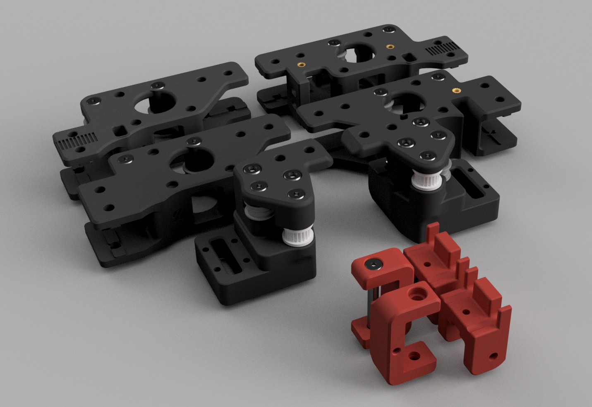

# Misumi Shoulder Bolts

Misumi MSB5 shoulder bolts based on the mod by Randell Hodges, updated with 2.4r1 and Trident parts. The X-axis parts are based on the Voron Trident.

## BOM
| Part                            | Quantity |
| :------------------------------ | :------- |
| MSB5-20                         | 4        |
| MSB5-35                         | 2        |
| MSB5-40                         | 4        |
| MSB5-LC21.5-FC5 (custom length) | 4        |
| M3x5x4 Insert                   | 14       |
